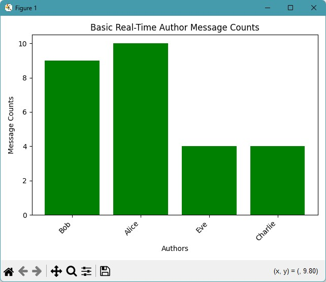
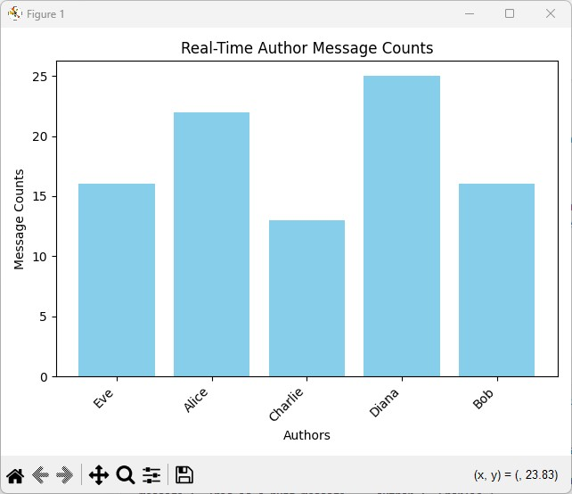

# buzzline-04-Sean

We can analyze and visualize different types of streaming data as the information arrives.
In this project I will be creating a producer-consumer pair that measures the counts of message length from a set of messages. This will be introduced in a bar chart for easy readability and comparability of counts.


# Steps to reproduce
## Task 1. Manage Local Project Virtual Environment

Follow the instructions in [MANAGE-VENV.md](https://github.com/denisecase/buzzline-01-case/docs/MANAGE-VENV.md) to:
1. Create your .venv
2. Activate .venv
3. Install the required dependencies using requirements.txt.

## Task 4. Start Zookeeper and Kafka (2 Terminals)

If Zookeeper and Kafka are not already running, you'll need to restart them.
See instructions at [SETUP-KAFKA.md] to:

1. Start Zookeeper Service ([link](https://github.com/denisecase/buzzline-02-case/blob/main/docs/SETUP-KAFKA.md#step-7-start-zookeeper-service-terminal-1))
2. Start Kafka ([link](https://github.com/denisecase/buzzline-02-case/blob/main/docs/SETUP-KAFKA.md#step-8-start-kafka-terminal-2))

---

## Task 5. Start a Basic (File-based, not Kafka) Streaming Application

This will take two terminals:

1. One to run the producer which writes to a file in the data folder. 
2. Another to run the consumer which reads from the dynamically updated file. 

### Producer Terminal

Start the producer to generate the messages. 

In VS Code, open a NEW terminal.
Use the commands below to activate .venv, and start the producer. 

Windows:

```shell
.venv\Scripts\activate
py -m producers.basic_json_producer_case
```

Mac/Linux:
```zsh
source .venv/bin/activate
python3 -m producers.basic_json_producer_case
```

### Consumer Terminal

Start the associated consumer that will process and visualize the messages. 

In VS Code, open a NEW terminal in your root project folder. 
Use the commands below to activate .venv, and start the consumer. 

Windows:
```shell
.venv\Scripts\activate
py -m consumers.project_consumer_Sean
```

Mac/Linux:
```zsh
source .venv/bin/activate
python3 -m consumers.project_consumer_Sean
```


## License
This project is licensed under the MIT License as an example project. 
You are encouraged to fork, copy, explore, and modify the code as you like. 
See the [LICENSE](LICENSE.txt) file for more.

## Live Chart Examples

Live Bar Chart (JSON file streaming)



Live Bar Chart (Kafka JSON streaming)



Live Line Chart with Alert (Kafka CSV streaming)


